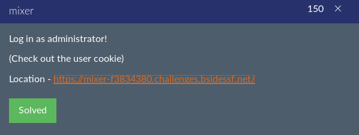
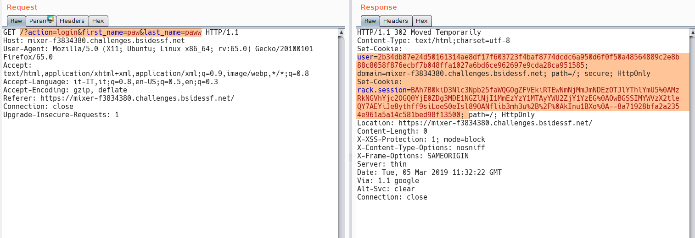
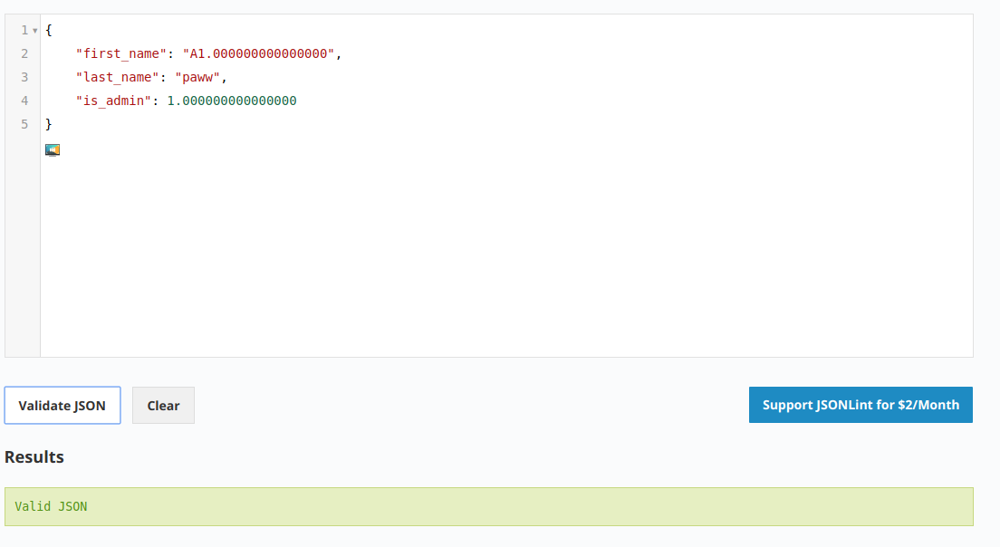

### writeup by p4w @ beerPWN sec-team

# BSidesSF 2019 CTF
## Mixer crypto-web level 150pti

Let's start login with some creds.

As we cen see the response include a cookie "user" witch is the one we need to focus on.
Just use this cookie and see what we get back

So, my guess is:
the cookie is encrypted with AES ECB mode, and if it is that's BAD!!! ;)
In order to understand well the nex part you probably need to know some basics about ECB mode.
Since I'm not a crypto guy I suggest you to google for some good material about AES and ECB mode encryption to google.
Here you can just get an idea on how that works <a href="https://en.wikipedia.org/wiki/Block_cipher_mode_of_operation">Block cipher.</a>

Let's start modify user cookie at random position by just flipping one byte, in order to verify if the assumption is correct.

As we can see the guess about AES ECB is probably correct, by flipping one byte we change the encrypted payload that now is no more a valid json.
Also we can see that the cookie is something like AES(json), where the json payload is:
### {"first_name":"paw","last_name":"paww","is_admin":0}

To get the flag we now need to modify the json payload to be something like this:
### {"first_name":"paw","last_name":"paww","is_admin":1}

First approach that i try was to just fuzz on the byte witch is responsible to encode the "0", but that doesn't work properly. Also as the challnge say we need to have an exact match with 1.

So i start thinking a little bit ddeper on this and it comes in my mind that if i can control an entire block of the encoded cookie with something that will be equivalent to 1, then i can reply the entire block between the <pre>"is_admin":</pre> and the <pre>0</pre> part.
So what about 1.00000000000000 ?
Note that length of 1.00000000000000 it's 16 byte.
The json payload will become:
### {"first_name":"A1.00000000000000","last_name":"paww","is_admin":1.000000000000000}
there will be one more 0 appended to the end, but this doesn't matter since is a floating point number.
and this will be also a valid json as we can see here:

If we can obtain this situation then we should become admin and get the flag.
So let's give some details about wot is going on:
the lenght of <pre>{"first_name":"A</pre>
it's 16 byte and this will corresponds to the first 16 byte block of the cookie (32 character since is hex encoded), then the next 16 byte of the cookie we will have our payload <b>1.00000000000000</b> that we want to reply.
Let's copy that part and paste in the right position of the cookie.

To found the righ position notice that lenght of <pre> {"first_name":"A1.00000000000000","last_name":"paww","is_admin": </pre>
is 64 byte then after that we need to paste our payload.

And here we get our flag :)

I also write a simple python script to automate the exploit.
Check it here <a href="https://github.com/beerpwn/ctf/blob/master/2019/BSidesSF_CTF/web/mixer/aes_block_reply_attack.py">exploit</a>.
